# Логика работы T-Invest Bot

Документ описывает, как бот работает в каждом режиме запуска, как проходит торговое решение, где включается риск-менеджер, как считаются комиссии и FIFO P&L, а также какие есть сильные стороны, ограничения и направления развития.

## Общая Архитектура

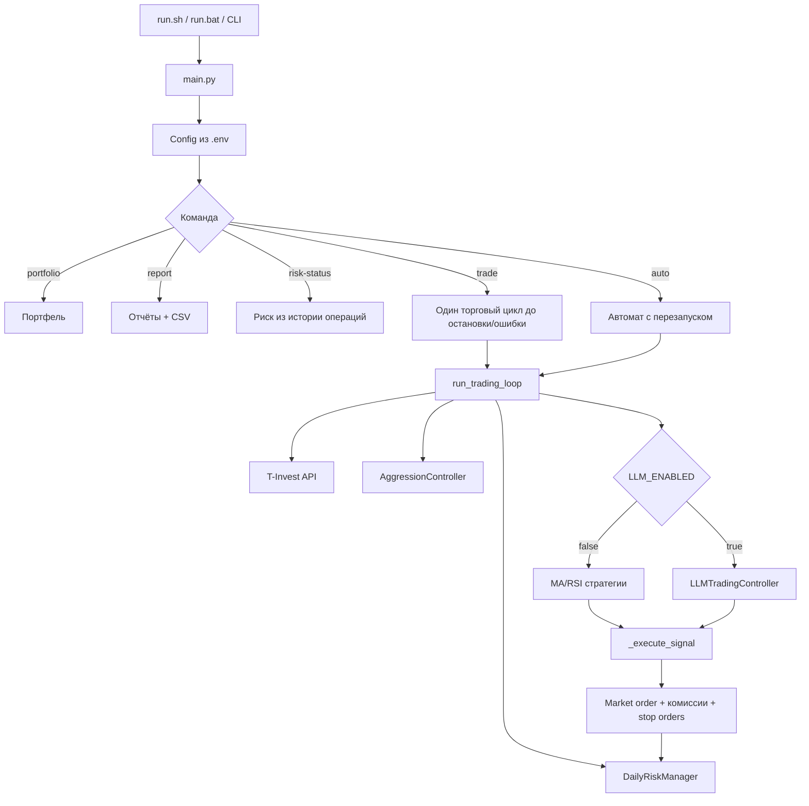

Главная идея: бот разделяет генерацию торгового сигнала, локальную валидацию, исполнение заявки и риск-учёт. Даже когда решение принимает LLM, ордер всё равно проходит через локальные ограничения.

## Режимы Запуска

### `portfolio`

Показывает текущие позиции и денежные остатки.

Flow:

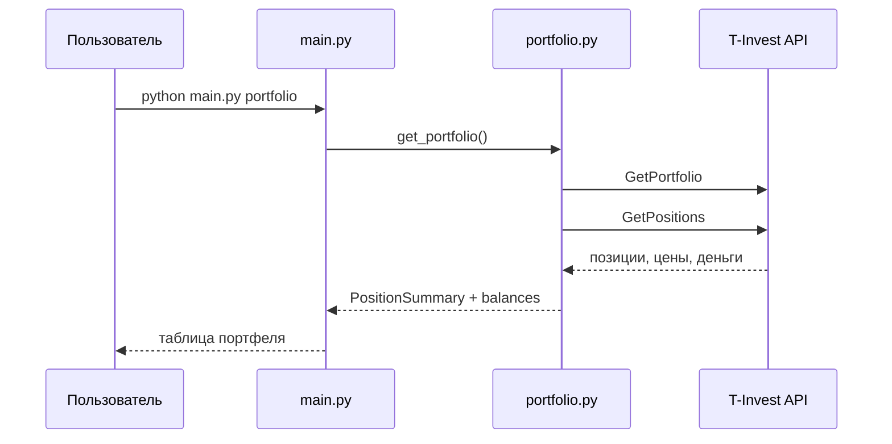

Особенности:

- Использует `TRADING_MODE` и `ACCOUNT_ID`.
- Ничего не покупает и не продаёт.
- Совместим с новой формой SDK: средняя цена берётся из `average_position_price_fifo` / `average_position_price`, если старого поля нет.

### `report`

Формирует отчёт по портфелю и операциям за период.

Flow:

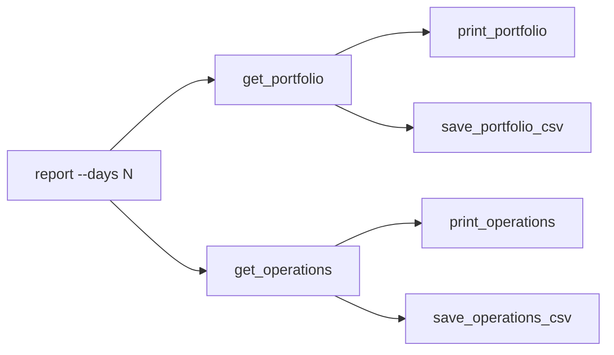

Плюсы:

- Быстро показывает состояние счёта и историю.
- Сохраняет CSV в `reports/`.

Минусы:

- Это отчётный режим, а не аналитический backtest.
- Метрики ограничены тем, что отдаёт API операций.

### `risk-status`

Показывает дневной риск, комиссии и FIFO P&L на основе истории операций.

Flow:

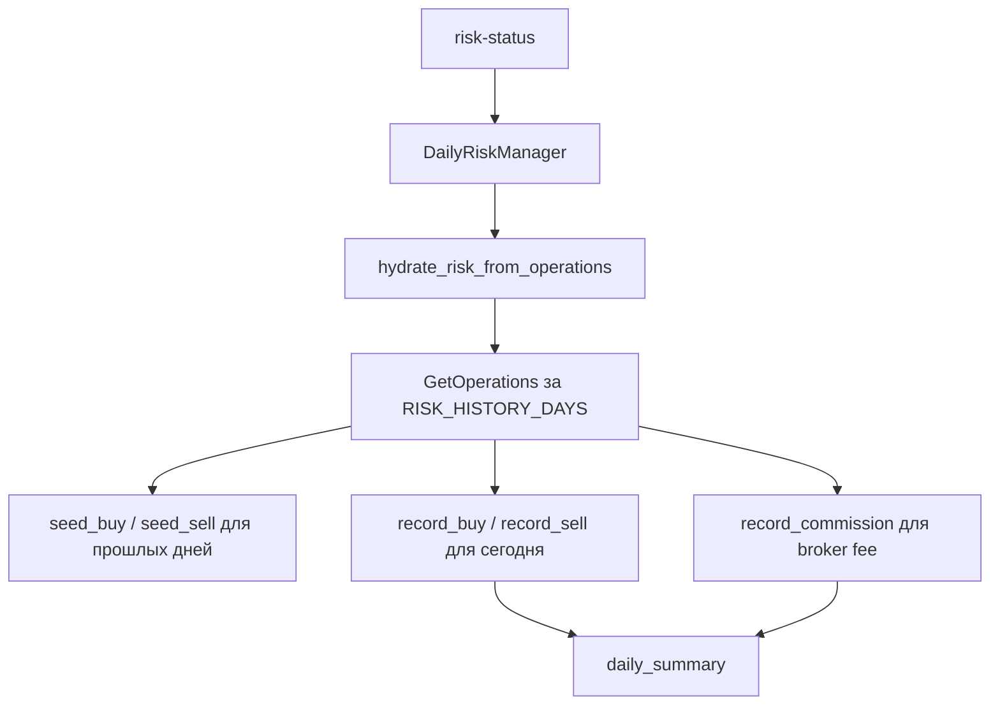

Особенности:

- Исторические сделки восстанавливают FIFO-базис.
- Сегодняшние сделки попадают в дневной итог.
- Отдельные broker fee операции учитываются в общей комиссии и отображаются в строках сделок.

## Торговые Режимы

### `trade`

Обычный торговый запуск. Работает до `Ctrl+C` или необработанной ошибки.

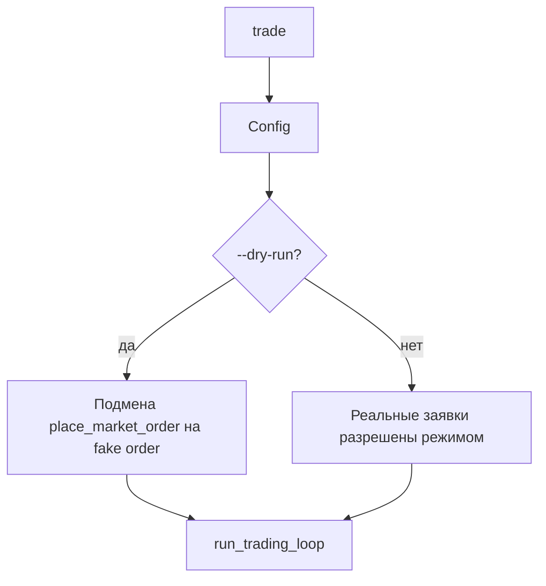

Если указан `--dry-run`, бот генерирует сигналы и проходит большую часть логики, но вместо реальной заявки использует заглушку.

### `auto`

Полный автомат с перезапуском после ошибок.

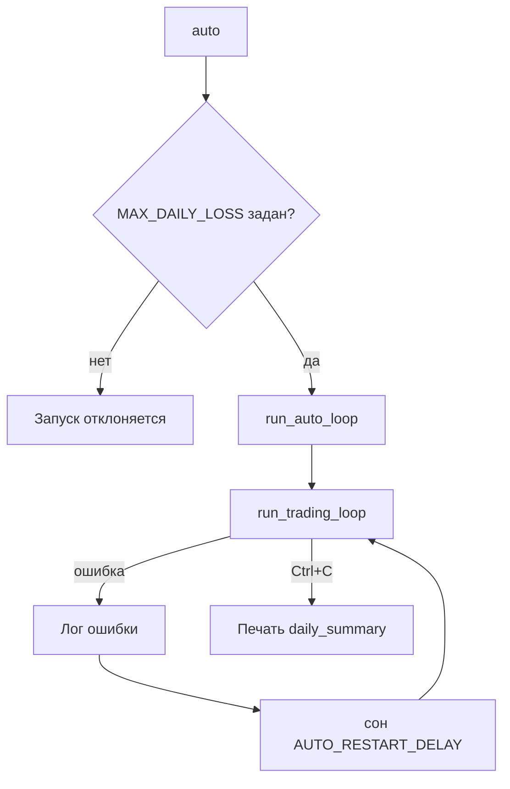

Отличия от `trade`:

- Требует `MAX_DAILY_LOSS`.
- При исключении ждёт `AUTO_RESTART_DELAY` и запускает цикл заново.
- При достижении дневного лимита не завершает процесс, а ждёт новый день.

Плюсы:

- Устойчивее к временным сетевым/API ошибкам.
- Удобен для долгой сессии без ручного перезапуска.

Минусы:

- Требует более аккуратных лимитов.
- Ошибочная конфигурация может многократно воспроизводиться после перезапуска.

## Sandbox И Production

Режим выбирается через `TRADING_MODE`.

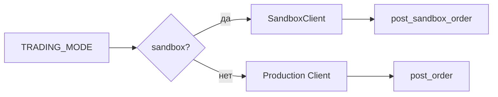

Sandbox:

- Виртуальные деньги и заявки.
- Подходит для проверки логики запуска, LLM-ответов и риск-менеджера.

Production:

- Реальные сделки.
- Требует full-access token.
- В `run.sh` и `run.bat` есть подтверждение `YES` перед production-пунктами.

## Rule-Based Режим

Работает, когда `LLM_ENABLED=false`.

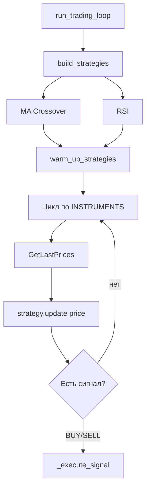

### MA Crossover

- `BUY`: быстрая MA пересекает медленную снизу вверх.
- `SELL`: быстрая MA пересекает медленную сверху вниз.

### RSI

- `BUY`: RSI выходит из перепроданности.
- `SELL`: RSI выходит из перекупленности.

Плюсы:

- Простая и предсказуемая логика.
- Легко отлаживать.
- Не зависит от LLM API и стоимости токенов.

Минусы:

- Не понимает контекст портфеля так глубоко, как LLM.
- Rule-based SELL может возникнуть по индикатору без предварительной интеллектуальной оценки альтернатив.
- Слабее адаптируется к режиму рынка.

## LLM Режим

Работает, когда `LLM_ENABLED=true`.

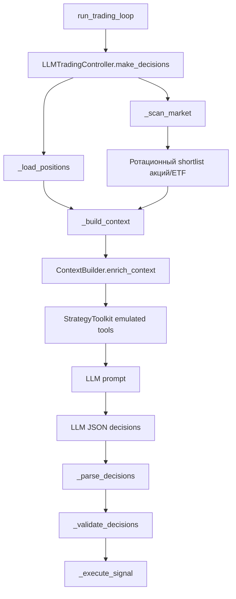

Что получает модель:

- market candidates;
- текущие позиции;
- дневной FIFO P&L;
- комиссии;
- остаток дневного риска;
- уровень агрессивности;
- результаты стратегий из `StrategyToolkit`;
- quick backtests;
- инструкции по формату JSON.

Что модель возвращает:

```json
{
  "decisions": [
    {
      "figi": "...",
      "ticker": "...",
      "action": "BUY|SELL|HOLD",
      "lots": 1,
      "confidence": 0.75,
      "strategy_mode": "balanced",
      "strategy_used": "trend_following",
      "params_override": {},
      "reasoning": "audit trail",
      "reason": "...",
      "risk_notes": "..."
    }
  ]
}
```

### Валидация LLM-Решений

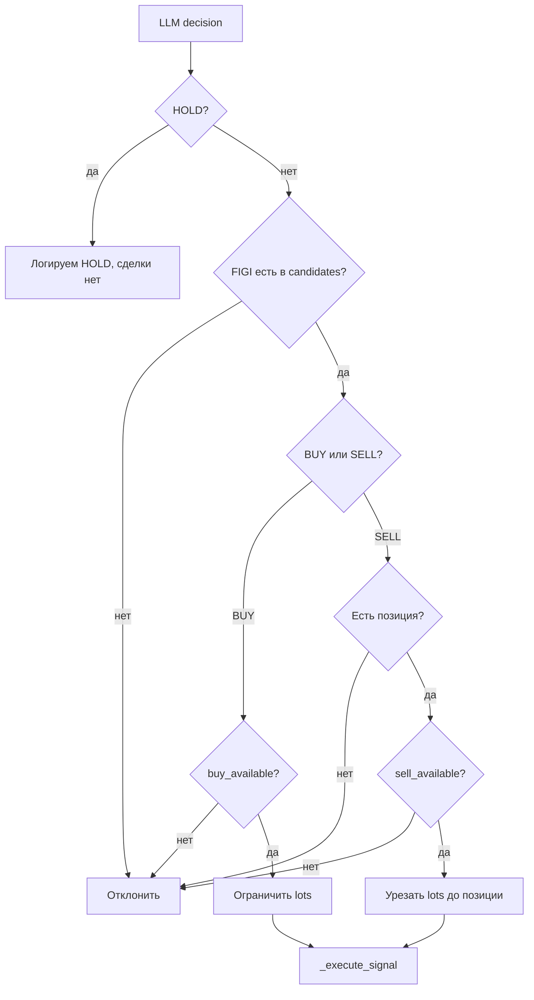

Плюсы:

- Модель видит шире одного индикатора.
- Может выбирать стратегию и объяснять режим: `capital_preservation`, `balanced`, `opportunity_seeking`.
- Может вернуть несколько `HOLD`, чтобы показать анализ альтернатив.
- Локальная валидация запрещает продажу без позиции и превышение лотов.

Минусы:

- Зависит от LLM API, ключей, задержек и стоимости.
- Нужен строгий контроль prompt/schema.
- Модель может быть консервативной и часто возвращать `HOLD`.
- Результат не гарантирует прибыль.

## Strategy Toolkit

Strategy Toolkit не торгует сам. Он считает детерминированные результаты для LLM.

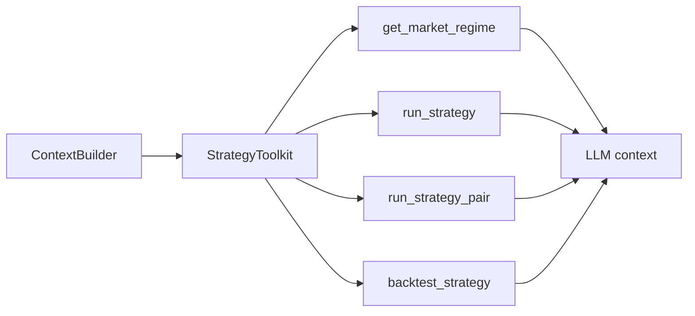

Доступные стратегии:

- `trend_following`;
- `mean_reversion`;
- `breakout`;
- `stat_arb`;
- `ml`.

Смысл слоя: дать LLM структурированные факты, но оставить финальное решение за моделью и локальной валидацией.

## Исполнение Сделки

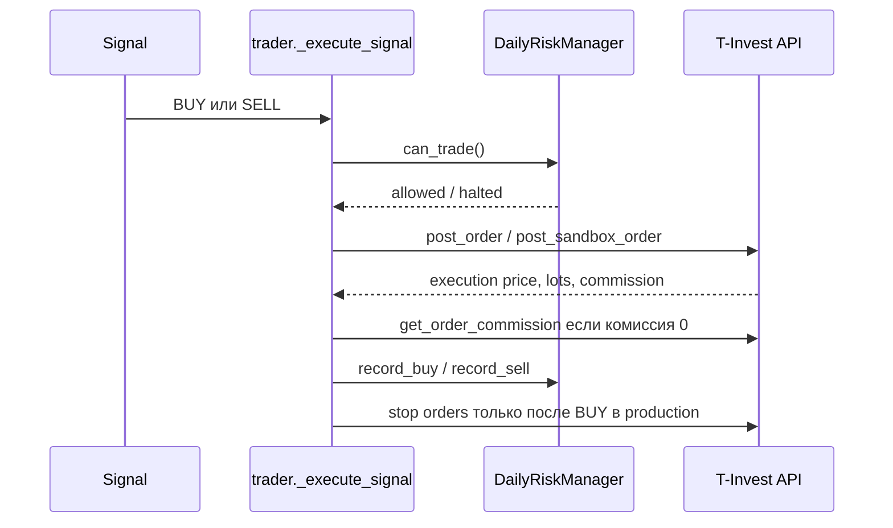

Для `SELL`:

- заявка выставляется как market sell;
- после исполнения `record_sell()` считает FIFO P&L;
- комиссия уменьшает чистый результат;
- стоп-ордера после продажи не создаются.

Для `BUY`:

- заявка выставляется как market buy;
- позиция добавляется в FIFO-книгу;
- в production после покупки выставляются take-profit и stop-loss.

## Риск-Менеджер И FIFO

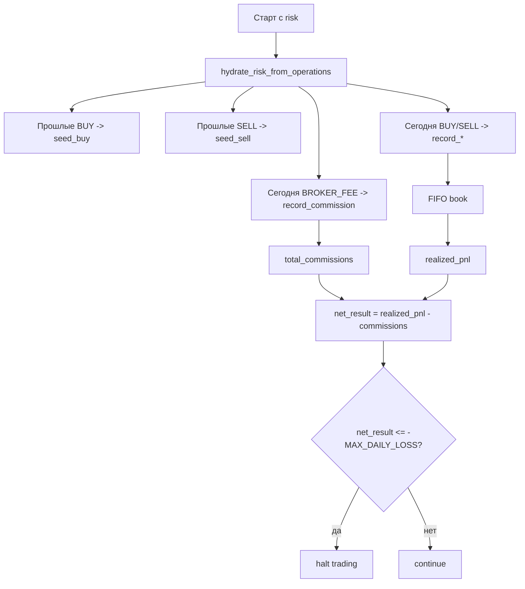

FIFO закрытие:

1. Берётся самая ранняя открытая покупка по FIGI.
2. Считается `(sell_price - buy_price) * shares`.
3. Если продажа закрыла только часть покупки, остаток остаётся в книге.
4. Если базис неизвестен, P&L считается консервативно как `0`.

Комиссии:

- комиссия из ответа заявки учитывается сразу;
- если ответ заявки вернул `0`, бот ищет broker fee через операции;
- отдельные broker fee операции также добавляются в дневной итог;
- для читаемого отчёта broker fee привязывается к последней сделке без комиссии.

## Агрессивность

Управляется через `AGGRESSION_LEVEL` и во время сессии:

- `+` повышает уровень;
- `-` снижает уровень;
- `.trading_control.json` позволяет менять уровень без интерактивного ввода.

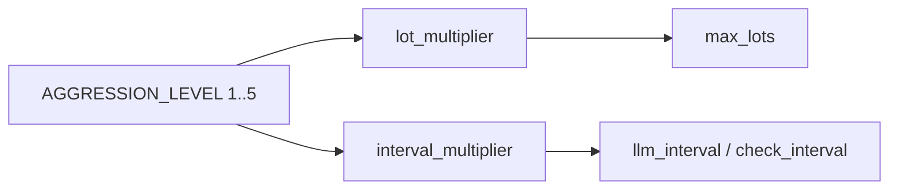

Важно: агрессивность больше не уменьшает ширину LLM-анализа. Количество тикеров задаётся `LLM_MAX_TICKERS`, чтобы модель видела рынок широко даже в осторожном режиме.

## Сравнение Режимов

| Режим | Что делает | Плюсы | Минусы | Когда использовать |
|---|---|---|---|---|
| `portfolio` | Показывает портфель | Безопасно, быстро | Нет торговли | Проверка счёта |
| `report` | Отчёты и CSV | Удобно для анализа | Не прогнозирует | Разбор истории |
| `risk-status` | FIFO P&L и комиссии | Проверяет дневной риск | Зависит от полноты операций API | Перед/после торгов |
| `trade --dry-run` | Сигналы без реальных сделок | Безопасная проверка логики | Нет реального исполнения | Перед production |
| `trade sandbox` | Торговля в sandbox | Проверка end-to-end | Sandbox отличается от рынка | Тестирование |
| `trade production` | Реальные сделки | Полный режим | Реальный риск денег | Только после dry-run/sandbox |
| `auto sandbox` | Sandbox с перезапуском | Тест устойчивости | Не реален по ликвидности | Долгий тест |
| `auto production` | Реальный автомат | Максимальная автономность | Максимальный риск | Только с лимитами и мониторингом |
| Rule-based | MA/RSI | Просто и прозрачно | Мало контекста | Базовая стратегия |
| LLM | Модель + tools + валидация | Широкий анализ, объяснения | LLM latency/cost/risk | Адаптивная торговля |

## Сильные Стороны Текущей Архитектуры

- Чёткое разделение: signal generation, validation, execution, risk accounting.
- LLM не исполняет заявки напрямую.
- Есть dry-run и sandbox.
- Есть дневной risk limit.
- FIFO-базис восстанавливается из истории операций.
- OpenRouter/DeepSeek/OpenAI/Qwen/GigaChat/Anthropic можно переключать конфигом.
- Strategy Toolkit даёт LLM структурированные данные, а не только сырой текст.
- Решения LLM пишутся в JSONL audit trail.

## Ограничения И Риски

- Market order может исполниться хуже ожидаемой цены.
- Rule-based режим не проверяет наличие позиции перед SELL так строго, как LLM-валидация.
- FIFO зависит от глубины `RISK_HISTORY_DAYS`; если история короче жизненного цикла позиции, базис может быть неполным.
- LLM может ошибиться в reasoning, даже если JSON валиден.
- API T-Invest может временно отдавать `UNAVAILABLE` или rate limit.
- Sandbox не полностью отражает реальные спреды, ликвидность и проскальзывание.
- ML-стратегия в текущем виде является вспомогательным сигналом, а не полноценной production ML-системой.

## Предложения По Развитию

### Безопасность Торговли

- Добавить локальную проверку позиции перед rule-based `SELL`, как в LLM-режиме.
- Добавить per-instrument лимиты: максимум позиции, максимум дневных сделок, cooldown после сделки.
- Добавить запрет торговли при широком spread или низкой ликвидности.
- Добавить ограничение max slippage для market order или перейти на limit order с timeout.

### Риск И P&L

- Хранить собственный persistent trade ledger в SQLite.
- Разделить комиссии по order_id, если API позволяет надёжно связать broker fee и сделку.
- Добавить unrealized P&L в risk status и LLM context.
- Добавить дневной лимит не только по убытку, но и по числу сделок/комиссиям.

### LLM-Оркестрация

- Добавить scorecard: почему тикер выбран/отклонён по фиксированным критериям.
- Сохранять полный prompt/response hash для аудита без утечки секретов.
- Добавить self-check: модель сначала формирует анализ, затем отдельный JSON decision.
- Поддержать native tool calls для провайдеров, где это стабильно.

### Стратегии

- Добавить стратегию по стакану/спреду, если API и лимиты позволяют.
- Добавить volatility targeting: размер позиции зависит от ATR/волатильности.
- Добавить portfolio-level allocation: не только сигнал по тикеру, но и балансировка портфеля.
- Добавить walk-forward backtesting и сравнение стратегий на одинаковом периоде.

### Эксплуатация

- Добавить health-check endpoint или Telegram уведомления.
- Добавить отдельный файл логов для сделок и ошибок.
- Добавить Windows smoke-test для `.bat` файлов через CI.
- Добавить GitHub Actions: lint, tests, compile, release validation.

## Рекомендуемый Рабочий Процесс

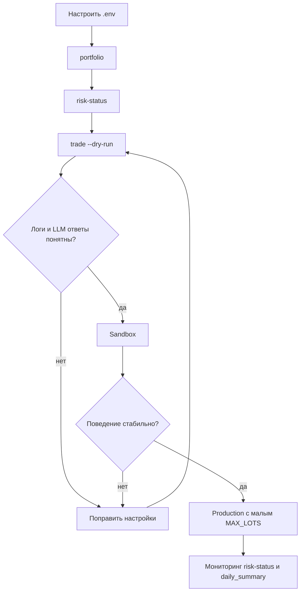

Для production рекомендуется начинать с:

- `MAX_LOTS=1`;
- небольшого `MAX_DAILY_LOSS`;
- `LLM_MAX_TICKERS=20`;
- `LLM_DECISION_INTERVAL` не ниже разумного лимита API/LLM;
- обязательного dry-run перед реальной сессией.
